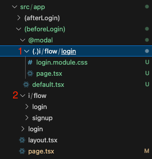

# NextJS 학습

- [Next + React Query 로 SNS 서비스 만들기](https://www.inflearn.com/course/lecture?courseSlug=next-react-query-sns%EC%84%9C%EB%B9%84%EC%8A%A4&unitId=194460) 를 참고하면서 진행합니다.

<br><br><br>

## 강의 내용

* `default.tsx` 는 페럴렐 모달의 root 에서 띄울 page 가 없을 때 사용한다.

* `@ 폴더` 안에 있는 폴더와 children 이 폴더가 겹쳐서, 동시에 렌더링 될 때가 있다.

    * 그럴 때는 `@ 폴더` 안에 `(.)겹치는폴더이름` 으로 라우트를 인터셉팅할 수 있다.

    * 단, 클라이언트에서 라우팅할 때만 인터셉트 라우팅이 적용된다. URL 에 직접 입력하면 작동하지 않는다. 그리고 새로고침해도 작동하지 않는다.

    * 페럴레 라우팅과 인터셉트 라우팅을 사용한 1번이 있기 때문에, 2번 폴더는 필요없다고 생각할 수 있다. 하지만 위에서 얘기했듯이 URL 로 접근하거나, 새로고침하면 2번으로 접근하기 때문에 필요하다.

    

* `_폴더이름` 은 private 폴더라고 하며, 강의에서는 공통 컴포넌트를 정리하기 위해 사용한다.

* `@폴더`, `(폴더)`, `_폴더`, 이 세가지는 URL 에 적용되지 않는다.

* 서버 컴포넌트에서는 클라이언트 컴포넌트를 import 할 수 있지만, 클라이언트 컴포넌트에서는 서버 컴포넌트를 import 하기 어렵다.

* 서버쪽과 클라이언트쪽이 `redirect` 하는 방식이 다르다.

    * 서버쪽 `redirect`

        ```ts
        import { redirect } from "next/navigation";

        export default function Login() {
            redirect("/i/flow/login/");
        }
        ```
    
    * 클라이언트쪽 `redirect`

        ```ts
        "use client";
        
        import { useRouter } from "next/navigation";

        export default function Login() {
            const router = userRouter();
            router.replace('/i/flow/login');
            // router.push('/i/flow/login');
            return null;
        }

        // router.push 는 전 라우터로 이동한다. 3에서 뒤로가기하면 2로 가는데, 2는 리다이렉션 시키기 때문에 다시 3으로 보낸다.
        // 1. localhost:3000 -> 2. localhost:3000/login -> 3. localhost:3000/i/flow/login

        // router.replace 는 전전 라우터로 이동한다.  3에서 뒤로가기하면 1로 간다.
        // localhost:3000 -> localhost:3000/login -> localhost:3000/i/flow/login
        ```
        
    * 항상 클라이언트쪽에서 URL 에 접근하는 것과 서버쪽에서 URL 에 접근하는 것 모두를 고려해서 개발하자.

    * `flex-grow : 1` 을 왼쪽 오른쪽에 주면 가운데 정렬이 된다.

    * `fix` 설정한 div 사이즈를 정할 때, 부모 사이즈로 하려면 `inherit` 을 사용하자

    * `useSelectedLayoutSegment` 와 `useSelectedLayoutSegments` 를 통해서, root layout 기준으로 자식 폴더의 이름을 가져온다. `ActiveLink` 만들기